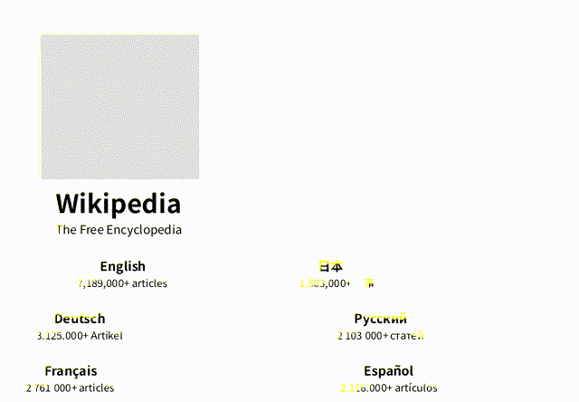

# AginxBrowser

**The Browser for AI Agents. See the live web. Interact with it.**

[](https://skills.sh/yinnho/aginxbrowser)
[](LICENSE)
[](https://browser.aginx.net/mcp)
[](https://browser.aginx.net/)

**[English](README.md)** | [中文文档](README.zh-CN.md)

A browser built for agents from the first line of code — not a human browser bolted onto automation. See the world, read it, search it, and act on it: one Rust binary with built-in V8, **no Chromium required**.

> Humans have Chrome. Agents have AginxBrowser.

One binary, zero dependencies, instant service. HTTP API + native MCP — agents plug in and go.

*Real pages rendered by AginxBrowser's diting engine (no Chromium) — Wikipedia, this repo, Rust. [Screenshot it yourself →](docs/API.md#screenshot)*



## Why Agents Need Their Own Browser

Measured against headless Chrome on the same 20 pages, same network ([bench](bench/README.md), 2026-08-28): **7.6× faster** to agent-usable text (p50 532 ms vs 4 053 ms), **~10× less memory** (227 MB for the whole process vs ~2.1 GB per Chrome page), and 0 hard failures where Chrome's `--dump-dom` produced no DOM on 5 of 40 loads. An agent's total cost is browser efficiency × model efficiency — this is the browser half.

Existing "browser automation" was built for humans or for one-shot scraping — not for agents:

| | AginxBrowser | Puppeteer/Playwright | Firecrawl | Browser-use |
|---|---|---|---|---|
| Designed for | **Agents first** | Human debugging | Scraping service | LLM wrapper |
| Dependencies | Single binary, no Chromium | Chromium ~500MB | Docker ~1GB | Chromium |
| Sees (screenshots) | ✅ built-in diting rendering engine | Needs Chromium | ❌ | Needs Chromium |
| Reads | markdown + js_extract | DIY | markdown | DIY |
| Finds (search) | ✅ 6-engine meta-search | ❌ | ❌ | ❌ |
| Acts | indexed session interaction | DevTools API | ❌ | LLM-driven |
| Protocol | HTTP + native MCP | Node API | HTTP | Python |
| TLS fingerprints | ✅ Chrome/Firefox/Safari | Plugin required | ❌ | ❌ |
| CAPTCHA solving | ✅ automatic | DIY | ❌ | ❌ |
| Interactive sessions | ✅ persistent | ✅ | ❌ | ✅ |

An agent needs five things from a browser: **see, read, find, act, deploy.** One binary covers them all — systemd-friendly, MCP-native for Claude/Cursor, zero dependencies.

**Core advantage: no Chromium.** AginxBrowser inlines a full browser engine (V8 + Rust HTTP stack + our own diting CSS/layout/paint rendering engine, with the Blitz/Stylo/Taffy lineage as its reference implementation). No Puppeteer, no Chrome, no Docker. One Rust binary under systemd is your agent browsing infrastructure.

## Three Things Stateless Renderers Can't Do

Most new "agent browsers" are stateless, fingerprint-less one-shot renderers — fine for public pages, dead on arrival against Cloudflare or login flows. AginxBrowser goes the opposite way:

- **🔐 Real TLS fingerprints** — stealth mode replicates the complete Chrome145 / Firefox133 / Safari / Edge TLS handshakes via BoringSSL (not just a UA string), switchable per request; Cloudflare Turnstile challenges wait automatically for `cf_clearance`. Fingerprint-less engines eat 403s — we get through.
- **🤝 Stateful interactive sessions** — persistent sessions (8-minute idle keep-alive), login state injectable and exportable (`session_create(cookies=...)` ↔ `session_cookies`), surviving pagination and multi-step flows. One-shot engines throw state away.
- **🔌 MCP native** — 16 tools as first-class citizens (not a CDP shim). Claude Code / Cursor / Claude Desktop connect in one line. HTTP + MCP dual protocol.

> Reference point: Cloudflare's Kitesurf explicitly ships neither real TLS-fingerprint negotiation nor persistent auth sessions — anti-bot and login territory is exactly where AginxBrowser plays.

Apache-2.0 open source, single binary — self-host today, no cloud lock-in.

## Capabilities

- **Tiered rendering**: static pages over plain HTTP (~100ms); V8 spins up only when JS rendering is needed (~1-2s) — 90% of the [bench](bench/README.md) page set served without spinning up V8 at all; every response reports which tier served it (`tier` field)
- **Multi-engine meta-search**: general web (Baidu / Bing / Sogou / WeChat / Google / DuckDuckGo), news (Bing News), code (Stack Overflow, GitHub), packages (npm, PyPI), academic (arXiv), AI models (Hugging Face) — queried concurrently, merged and deduplicated. Operators can plug a private Meilisearch index into the same `/search`. Search → read in one step
- **Image search**: `categories=images` hits Baidu/Bing image indexes and returns direct binary `image_url` links (downloadable straight to jpg/png) plus `source_url` provenance
- **Interactive sessions**: persistent browser sessions with indexed interaction (`state/click/input/scroll/eval`) — agents browse like humans do, and `session_export` turns what an agent figured out into a runnable curl replay script (zero model tokens on re-run)
- **CAPTCHA auto-solve**: type detection with optional 2captcha integration — search never stalls on verification pages
- **JS data extraction**: `js_extract` pulls `window.__INITIAL_STATE__` and other structured data out of SPAs
- **Screenshot rendering**: `/screenshot` endpoint (opt-in `--features screenshot`) paints the JS-rendered DOM with our own diting rendering engine — pure CPU, no Chromium — to PNG. Vision input for agents
- **Cloudflare auto-wait**: detects "Just a moment..." challenge pages and waits out `cf_clearance`
- **TLS fingerprint spoofing**: stealth mode impersonates Chrome145/Firefox133/Safari/Edge, switchable per request
- **MCP server**: `--mcp` mode exposes 16 tools (fetch/eval/click/search/download + 11 session tools) — Claude Code / Claude Desktop / Cursor call them directly
- **Firecrawl compatible**: `/v1/scrape` endpoint — existing Firecrawl clients migrate by changing the base URL
- **DNS rebinding protection**: built-in SSRF guard + post-resolution IP validation

## What It's For

Not demos — real jobs agent browsers are doing today:

- **Grind through admin consoles** — AWS / App Store Connect / Google Play, dozens of menu layers per task. Let the agent click; it comes back only when authorization is needed.
- **Batch actions behind login** — fill carts, dig through order history, check pages that only render while logged in. Inject cookies, operate, export for reuse.
- **Past anti-bot walls** — Cloudflare protection, Turnstile challenges, TLS fingerprint checks. Stealth mode pushes through instead of retreating at 403.
- **The Chinese internet** — Baidu / Sogou / WeChat meta-search across 5 engines, correct Chinese page rendering. Not English-web-only.
- **On-the-spot scripting** — agent reads the page, writes JS, evals it: highlighted comparison tables, reflowed content, product filters on hidden parameters. GreaseMonkey-on-steroids.
- **Multimodal vision** — screenshots as visual input for look-and-judge flows: picking seats, recognizing layouts, verifying rendering.

## Quick Start

Try the hosted instance first: **https://browser.aginx.net/**

**One-command full install** (SKILL.md trigger surface + MCP tools + verification):

```bash
# Download -> inspect the contents -> run only after review (never blind-run network scripts)
curl -fsSL https://raw.githubusercontent.com/yinnho/aginxbrowser/main/skill.sh -o skill.sh
less skill.sh
bash skill.sh
```

**Register MCP only**:

```bash
claude mcp add aginxbrowser --transport http https://browser.aginx.net/mcp
```

**Install the skill trigger surface via [skills.sh](https://www.skills.sh)**:

```bash
npx skills add yinnho/aginxbrowser
```

Self-hosting:

```bash
# macOS / Linux via Homebrew
brew install yinnho/aginxbrowser/aginxbrowser
aginxbrowser doctor   # features + fonts + egress self-check

# Docker (Docker Hub, mirrored on GHCR)
docker run -p 8089:8089 yinnho/aginxbrowser:latest
# (or ghcr.io/yinnho/aginxbrowser:latest)

# Or the prebuilt binary (platform detect + sha256 + mirror fallback + doctor self-check)
# Cautious: download -> inspect -> run (never blind-run network scripts)
curl -fsSL https://browser.aginx.net/install.sh -o install.sh
less install.sh && bash install.sh
# Or straight in, if you trust the repo:
#   curl -fsSL https://browser.aginx.net/install.sh | sh
# GitHub slow/blocked? AGINXBROWSER_GH_PROXY=https://ghfast.top/ bash install.sh
aginxbrowser doctor   # features + fonts + egress self-check

# Or build from source (--features stealth,screenshot or you lose both)
cargo build --release --features stealth,screenshot

# Start the service
./target/release/aginxbrowser
# → Listening on 0.0.0.0:8089

# Verify
curl http://127.0.0.1:8089/health
# → {"status":"ok","engine":"diting"}

# Fetch a page
curl -sS -X POST http://127.0.0.1:8089/fetch \
  -H "Content-Type: application/json" \
  -d '{"url":"https://example.com"}'

# Search
curl -sS -X POST http://127.0.0.1:8089/search \
  -H "Content-Type: application/json" \
  -d '{"q":"macbook price","max_results":5}'

# Create an interactive session
curl -sS -X POST http://127.0.0.1:8089/session/create \
  -H "Content-Type: application/json" \
  -d '{"url":"https://example.com"}'
# → {"session_id":"s_1","url":"https://example.com/"}

# MCP mode (for AI agents)
./target/release/aginxbrowser --mcp
```

## Project Layout

```
aginxbrowser/
├── Cargo.toml
├── build.rs              # V8 snapshot generation
├── js/
│   └── bootstrap.js      # V8 bootstrap script
├── README.md
├── docs/
│   └── API.md            # Full API reference (HTTP + MCP)
├── bench/                # Benchmark harness + results (vs headless Chrome)
│   ├── README.md         #   methodology + numbers
│   ├── pages.txt         #   fixed 20-page set
│   ├── run.py            #   harness
│   ├── summarize.py      #   TSV → results table
│   └── results/          #   raw run data
└── src/
    ├── main.rs              # HTTP service entry & routing
    ├── server.rs            # Business layer (fetch/click/eval/search)
    ├── session.rs           # Interactive browser sessions
    ├── captcha.rs           # CAPTCHA detection & auto-solve
    ├── render.rs            # Tiered rendering (HTTP direct → diting browser engine)
    ├── mcp.rs               # MCP server (16 tools)
    ├── firecrawl_compat.rs  # Firecrawl-compatible /v1/scrape endpoint
    ├── browser.rs           # Top-level API: Browser, BrowserBuilder
    ├── page.rs              # Top-level API: Page, Element
    ├── config.rs            # BrowserConfig
    ├── cookie.rs            # CookieStore
    ├── error.rs             # Error types
    ├── search/              # Native search engines
    │   ├── mod.rs           #   SearchEngine trait, Registry, merge/dedupe, progressive backoff
    │   ├── baidu.rs         #   Baidu (JSON API, wreq stealth)
    │   ├── baidu_images.rs  #   Baidu Images (acjson API, images category)
    │   ├── bing.rs          #   Bing (HTML parsing, plain reqwest)
    │   ├── bing_images.rs   #   Bing Images (images/async endpoint, images category)
    │   ├── sogou.rs         #   Sogou web (HTML parsing, plain reqwest)
    │   ├── sogou_wechat.rs  #   Sogou WeChat (HTML parsing + /link resolution)
    │   ├── duckduckgo.rs    #   DuckDuckGo (html.duckduckgo.com, general; direct-first)
    │   ├── google.rs        #   Google (HTML parsing, wreq stealth + proxy)
    │   ├── stackexchange.rs #   Stack Overflow (SE API v2.3, code category)
    │   ├── github_repos.rs  #   GitHub repos (api.github.com, code category)
    │   ├── arxiv.rs         #   arXiv (Atom API, academic category)
    │   ├── bing_news.rs     #   Bing News RSS (news category; proxy-first)
    │   ├── huggingface.rs   #   HF Hub models/datasets/spaces (ai category)
    │   ├── npm.rs           #   npm packages (npms.io API, packages category)
    │   ├── pypi.rs          #   PyPI name resolution (JSON API, packages)
    │   └── meilisearch.rs   #   Private-index adapter (env-configured)
    │
    ├── diting_dom/          # HTML parsing, DOM tree, CSS selectors
    ├── diting_net/          # HTTP client, cookies, encoding, proxies
    ├── diting_js/           # V8 runtime, JS ops, module loading
    └── diting_browser/      # Page navigation, lifecycle, browser context
```

## Build

```bash
# Standard build (no stealth; TLS fingerprint features inactive)
cargo build --release

# With stealth (requires go + cmake + C++ toolchain; enables TLS fingerprint spoofing)
cargo build --release --features stealth

# With screenshot rendering (enables /screenshot; adds the rendering stack, +30-40MB)
cargo build --release --features screenshot

# Full featured (recommended for production)
cargo build --release --features stealth,screenshot
```

Requirements: Rust 1.78+; the V8 static library downloads automatically on first build. The stealth feature additionally needs `go`, `cmake`, and a C++ compiler. The screenshot feature ships with a bundled CJK font subset (GB2312 + common symbols) — no system fonts required for correct Chinese rendering.

## Runtime Environment Variables

| Variable | Default | Description |
|------|------|------|
| `AGINXBROWSER_BIND` | `0.0.0.0:8089` | Listen address |
| `AGINXBROWSER_STEALTH` | enabled | `0` disables stealth (for diagnostics) |
| `AGINXBROWSER_UA` | Linux Chrome145 | Spoofed User-Agent |
| `AGINXBROWSER_ACCEPT_LANGUAGE` | `zh-CN,zh;q=0.9,en;q=0.8` | Accept-Language header |
| `AGINXBROWSER_PROXY` | none | Optional fallback proxy. Blocked-source engines (Google, Bing News, Hugging Face) connect directly first and fall through to this proxy only when the direct attempt fails — overseas deployments need no proxy at all; per-request `use_proxy:true` also routes fetch/search through it |
| `AGINXBROWSER_CACHE_TTL_SECS` | `600` | `/fetch` cache TTL, `0` disables |
| `AGINXBROWSER_IGNORE_ROBOTS` | unset | robots.txt is honored by default on `/fetch`, `/screenshot`, `/download` and MCP tools; set `1` to skip checks (operator opt-out) |
| `AGINXBROWSER_ROBOTS_TTL_SECS` | `3600` | Per-host robots.txt policy cache TTL |
| `AGINXBROWSER_MCP_ALLOWED_HOSTS` | unset | Extra `Host` values accepted by `/mcp` (comma-separated) — the transport's DNS-rebinding guard defaults to loopback, so add your LAN IP or Docker hostname when other machines call the instance |
| `CAPTCHA_SOLVER_API_KEY` | none | 2captcha API key; enables CAPTCHA auto-solving |
| `CAPTCHA_SOLVER_SERVICE` | `2captcha` | CAPTCHA solving provider |
| `AGINXBROWSER_MEILI_URL` | none | Meilisearch base URL; set to enable the private-index engine |
| `AGINXBROWSER_MEILI_INDEX` | none | Meilisearch index uid to query |
| `AGINXBROWSER_MEILI_KEY` | none | Optional Bearer key for the Meilisearch instance |

## API Documentation

**Full API reference** → [`docs/API.md`](docs/API.md)
**Security audit notes** → [`docs/skills-sh-audit.md`](docs/skills-sh-audit.md) — why skills.sh shows "Critical Risk", and which real product feature each warning corresponds to

Covers:
- All HTTP endpoints (`/fetch`, `/click`, `/eval`, `/search`, `/v1/scrape`, 10 session endpoints)
- All 15 MCP server tools and their parameters
- Claude Code / Claude Desktop / Cursor client configuration
- Environment variables, error codes, per-site scraping examples

## Plugging Into Other Systems

AginxBrowser is **pure attach-alongside infrastructure** — like a real browser, it runs as an independent service that anything can call, without embedding host code or polluting host config. Deploy one instance per machine (under systemd) and every app needing "render + scrape" capability shares it.

Integration: read the environment variable `AGINXBROWSER_URL=http://127.0.0.1:8089`. Unset → behavior unchanged; set → risk-controlled sites automatically route through AginxBrowser for rendering, falling back gracefully on failure.

## Known Limitations

1. **Screenshots are opt-in**: `/screenshot` requires `cargo build --release --features screenshot` (adds the rendering stack, +30-40MB). Default render engine is diting (our own CSS+layout+paint stack); pass `engine: "blitz"` to opt back into the Blitz reference pipeline. Complex-site CSS is approximate on both (not pixel-perfect like Chromium)
2. **Element coordinates supported (block-level)**: `/screenshot` with `selector` returns element page coordinates (`selector_rects`, CSS px); `selector` alone crops directly to that element. Pure inline elements (`<a>text</a>`) have no independent box — pick a block ancestor
3. **JS interaction broadly works; heavy-fingerprint pages may still fail**: React/Vue event delegation works normally (URL-reflection attributes like `src`/`href` resolve to absolute URLs so Next.js/webpack hydrate and clicks trigger handlers). Heavy-fingerprint auth pages (WorkOS/Cloudflare) probing `navigator.plugins`, WebGL canvas etc. may still break until stealth fingerprint coverage completes
4. **Proxy support**: HTTP/HTTPS/SOCKS5 via `AGINXBROWSER_PROXY`
5. **Hard risk-controlled sites**: Baidu Wenku unsupported; Zhihu articles need a valid `__zse_ck`

## License

Consistent with the OpenCarrier main project. Apache-2.0.
